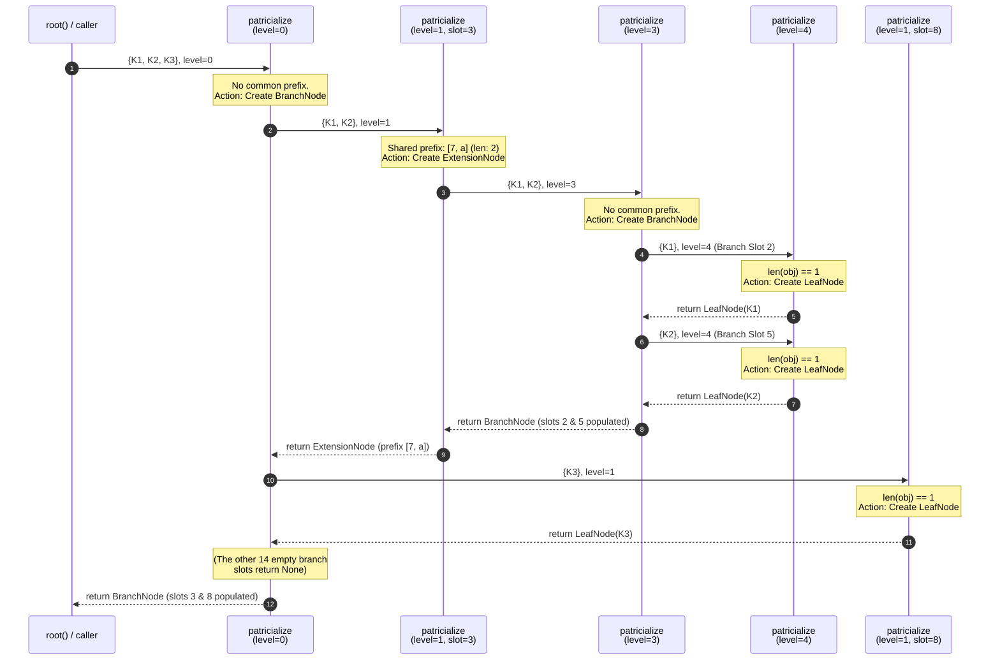

# Preface

This article is part of a series analyzing the core components of Ethereum through the **Ethereum Execution Layer Specification (EELS)**.

**What is EELS?**
EELS is a Python reference implementation of the Ethereum execution client, designed with a focus on readability and clarity. It serves as a programmer-friendly, up-to-date successor to the original Yellow Paper and is the primary tool for prototyping new Ethereum Improvement Proposals (EIPs). EELS provides complete protocol snapshots at each fork and rendered diffs between them.

**Scope and Implementation**
Note that EELS does not implement the JSON-RPC API or P2P networking. To validate blocks, it requires an external RPC provider to fetch data, which EELS then processes and stores in a local database.

**Version Reference**
The code analysis in this article is based on the **Osaka** fork:
[ethereum/execution-specs (Osaka)](https://github.com/ethereum/execution-specs/tree/forks/amsterdam/src/ethereum/forks/osaka)

---

# Introduction

In this article, we leave the high-level theory of MPT behind and dive directly into the official Python implementation. By tracing a concrete example of three accounts entering the state trie, we will demystify the core algorithms that build the Ethereum world state. We will discuss:

- **The Entry Pipeline:** How raw keys and values are prepped for the tree.
- **The generation of MPT:** A line-by-line look at how the trie autonomously structures itself.
- **The Merkle Hashing Rule:** How the trie balances cryptographic security with database efficiency.

**What you will learn:**

By the end of this article, you will understand the exact, function-by-function pipeline that translates raw blockchain data into a verifiable Merkle root.

All the code we used is inside the [osaka/trie.py](https://github.com/ethereum/execution-specs/blob/forks/amsterdam/src/ethereum/forks/osaka/trie.py).

---

# A Code-Driven Walkthrough

We’ll build a small state trie with three accounts. To keep things readable, we'll assume their hashed addresses (keys) begin with specific nibbles (hex characters):

| Account | Hashed Key Prefix | Balance |
| --- | --- | --- |
| **A1** | `[3, 7, a, 2, 9, f, ...]` | 100 wei |
| **A2** | `[3, 7, a, 5, 1, c, ...]` | 200 wei |
| **A3** | `[8, b, 0, 4, e, 3, ...]` | 300 wei |

Notice that **A1** and **A2** share the first three nibbles (`3, 7, a`), which will force our trie to create an extension node.

Before we dive into the code, here is the high-level roadmap of how a raw key-value pair transforms into a Merkle root:

%20Code%20Implementation%20of%20Merkle-Patricia%20Tri/image.png)

Let's walk through this pipeline stage by stage.

---

## Stage 1: Storing Data (`trie_set`)

The entry point. When the EVM updates an account balance, it calls the `trie_set` function:

```python
def trie_set(trie: Trie[K, V], key: K, value: V) -> None:
    if value == trie.default:
        if key in trie._data:
            del trie._data[key]
    else:
        trie._data[key] = value
```

Notice what is *not* happening here: there is no hashing, no tree-building, and no RLP encoding. The `Trie` object simply acts as a lazy-loaded dictionary (`trie._data`).

However, `trie_set` has one crucial job: **it deletes the key if the value is empty (`trie.default`)**. This is what keeps the Merkle Patricia Trie sparse. It never wastes space storing "empty" slots.

At this point, our internal dict looks like a standard Python map:

```python
{
  b'\\xa1...': Account(balance=100, ...),
  b'\\xa2...': Account(balance=200, ...),
  b'\\xa3...': Account(balance=300, ...)
}
```

---

## Stage 2: Key Transformation (`_prepare_trie`)

The construction of the tree only begins when we ask for the state root by calling `root()`. The first thing `root()` does is pass our raw dictionary to `_prepare_trie()`.

This function iterates over every `(key, value)` pair and prepares them for the tree structure through three crucial transformations:

**1. Value Encoding via `encode_node`:**
Each `Account` object is serialized into raw `Bytes` using RLP (Recursive Length Prefix) encoding. For example, `Account(balance=100)` becomes something like `b'\\xc5\\x80\\x64\\x80\\x80'` (packing the nonce, balance, storage root, and code hash).

**2. Key Hashing (The `secured` Parameter):**
Ethereum's MPT codebase supports both "secured" and "unsecured" modes. In `_prepare_trie`, you'll see this check:

```python
if trie.secured:
    # "secure" tries hash keys once before construction
    key = keccak256(preimage)
else:
    key = preimage
```

**Why do we need this?**
If an attacker can choose their own keys, they could intentionally generate thousands of addresses that share extremely long common prefixes. This would force the node to build a pathologically deep, unbalanced tree, making reads and writes computationally expensive and opening the network to Denial-of-Service (DoS) attacks.

By setting `secured = True`, the key is hashed with `keccak256` *before* it enters the trie. Because cryptographic hashes are uniformly distributed and completely unpredictable, the tree remains naturally balanced, no matter what raw addresses a user generates.

- **When is it `True`?** The **State Trie** (mapping addresses to accounts) and the **Storage Trie** (mapping contract storage keys to values) are always secured.
- **When is it `False`?** The **Transaction Trie** and **Receipt Trie** stored in a block header are unsecured. Their keys are simply the transaction's sequential index in the block (`0`, `1`, `2`, etc., RLP encoded). Since these keys are purely sequential and dictated by the block—not manipulatable by users—there is no risk of an unbalanced tree attack, and Ethereum can skip the hashing overhead.

**3. Nibble Expansion (`bytes_to_nibble_list`):**
Once we have our key (hashed or unhashed), it is currently a sequence of 8-bit bytes. But the MPT is a *hexary* trie—it branches 16 ways, not 256. This means our key needs to be broken down into base-16 characters, or **nibbles** (4-bit chunks).

To do this, the key is passed into `bytes_to_nibble_list()`:

```python
def bytes_to_nibble_list(bytes_: Bytes) -> Bytes:
    nibble_list = bytearray(2 * len(bytes_))
    for byte_index, byte in enumerate(bytes_):
        nibble_list[byte_index * 2] = (byte & 0xF0) >> 4     # Extract high nibble
        nibble_list[byte_index * 2 + 1] = byte & 0x0F        # Extract low nibble
    return Bytes(nibble_list)
```

This function takes a raw `Bytes` object and allocates a new array exactly twice as long. It then iterates through each byte, using bitwise masks to split it perfectly in half:

- `byte & 0xF0 >> 4`: Isolates the top 4 bits (the "high" nibble) and shifts them down to a standard integer format (0-15).
- `byte & 0x0F`: Isolates the bottom 4 bits (the "low" nibble).

For example, a single byte `0xAF` is split into two separate elements: `[0xA, 0xF]`.

Because our State Trie is secured, the 32-byte `keccak256` hash is expanded into a list of exactly 64 nibbles. Our output at the end of `_prepare_trie` is a flat dictionary mapping `64-nibble-list -> RLP_encoded_bytes`. No tree yet—just a well-formatted map ready to be structured.

%20Code%20Implementation%20of%20Merkle-Patricia%20Tri/image%201.png)

---

## Stage 3: Building the Tree (`patricialize`)

The `patricialize` function takes our flat dictionary mapping (`obj`) and recursively builds the tree structure. It does this by keeping track of a `level` variable, which acts as our current index moving from left to right across the 64-nibble keys.

Let's trace it with our three keys:
`K1 =[3, 7, a, 2...]` | `K2 = [3, 7, a, 5...]` | `K3 = [8, b, 0, 4...]`

### 1. The Leaf Node Base Case

At the very beginning of the function, we see the simplest case:

```python
    if len(obj) == 0:
        return None

    arbitrary_key = next(iter(obj))

    # if leaf node
    if len(obj) == 1:
        leaf = LeafNode(arbitrary_key[level:], obj[arbitrary_key])
        return leaf
```

If the recursion passes down a dictionary containing only a single key, there's no need to branch anymore. The trie immediately creates a `LeafNode`. It simply slices the `arbitrary_key` from the current `level` to the end (`arbitrary_key[level:]`) as the `rest_of_key` and saves the RLP-encoded account data.

For example, when K3 is isolated in its own branch, it triggers this block immediately.

### 2. Finding the Common Prefix

If there are multiple keys (like in our first call with K1, K2, and K3), the code checks if they share a common path starting at the current `level`:

```python
    # prepare for extension node check by finding max j such that all keys in
    # obj have the same key[i:j]
    substring = arbitrary_key[level:]
    prefix_length = len(substring)
    for key in obj:
        prefix_length = min(
            prefix_length, common_prefix_length(substring, key[level:])
        )

        # finished searching, found another key at the current level
        if prefix_length == 0:
            break
```

It picks an `arbitrary_key` (let's say K1) and compares its remaining nibbles against every other key in the dictionary. It uses `min()` to shrink the `prefix_length` to the common denominator across *all* keys.

- **At `level=0`:** It compares K1 against K2 (shares `[3, 7, a]`) and then against K3 (starts with `8`, shares nothing). Because `3 != 8`, the `prefix_length` becomes `0`, and the loop `break`s early.

### 3. Creating an Extension Node

When all keys *do* share a prefix, the trie compresses that shared path into an **ExtensionNode** to save space:

```python
    # if extension node
    if prefix_length > 0:
        prefix = arbitrary_key[int(level) : int(level) + prefix_length]
        return ExtensionNode(
            prefix,
            encode_internal_node(
                patricialize(obj, level + Uint(prefix_length))
            ),
        )
```

**At `level=1` (processing K1 and K2):** After branching off K3, the function recurses with just K1 and K2. The prefix check runs again. Both share `[7, a]`, so `prefix_length = 2`.
The code slices out `[7, a]` as the `prefix`, builds an `ExtensionNode`, and—crucially—calls `patricialize` again on the exact same `obj`, but advances the `level` cursor by `prefix_length`. (So `level` jumps from 1 to 3).

*(Note: The `encode_internal_node` wrapper around the recursive call is what applies the hashing rule we will discuss in Stage 4).*

### 4. Creating a Branch Node

If `prefix_length == 0` (like in our very first call at `level=0`, or beneath our extension at `level=3`), the keys diverge immediately. The code builds a **BranchNode** by distributing the keys into 16 "buckets":

```python
    branches: List[MutableMapping[Bytes, Bytes]] =[]
    for _ in range(16):
        branches.append({})
    value = b""

    for key in obj:
        if len(key) == level:
            # shouldn't ever have an account or receipt in an internal node
            # ...[AssertionError check] ...
            value = obj[key]
        else:
            branches[key[level]][key] = obj[key]
```

It creates 16 empty dictionaries (`branches`). It iterates over the keys, looks at the *single nibble* at the current `level` (`key[level]`), and drops the key into the corresponding bucket.

- **At `level=0`:** K1 and K2 go into `branches[3]`. K3 goes into `branches[8]`.
- **At `level=3` (after the `[7,a]` extension):** K1's next nibble is `2`, so it goes to `branches[2]`. K2's next nibble is `5`, so it goes to `branches[5]`.

*(The `if len(key) == level:` check handles a case where a value is stored exactly at the branch itself. Because state trie keys are always exactly 64 nibbles long, the code correctly notes via comment and an `AssertionError` that this never happens for accounts).*

Finally, it recursively calls `patricialize` on all 16 buckets, advancing `level` by exactly `1` for the branch itself:

```python
    subnodes = tuple(
        encode_internal_node(patricialize(branches[k], level + Uint(1)))
        for k in range(16)
    )
    return BranchNode(
        cast(BranchSubnodes, assert_type(subnodes, Tuple[Extended, ...])),
        value,
    )
```

This recursive elegance—shifting between creating Leaves when isolated, Extensions when sharing a path, and Branches when diverging—is what autonomously shapes our flat dictionary into the optimized MPT structure.

Below figure shows how whole process as we described above:



Here is the resulting tree structure in memory:

%20Code%20Implementation%20of%20Merkle-Patricia%20Tri/image%202.png)

---

## Stage 4: Node Encoding & Hashing (`encode_internal_node`)

Because `patricialize` is a recursive function, the tree is built **bottom-up**. As soon as a node (Leaf, Extension, or Branch) is created at the deepest levels, it is immediately wrapped in the `encode_internal_node` function.

This function is responsible for the cryptographic linking that turns our standard tree into a *Merkle* tree. It does this in three distinct steps:

### 1. Preparing the Node for RLP

First, the Python objects (`LeafNode`, `ExtensionNode`, `BranchNode`) must be converted into standard lists or tuples so they can be serialized via RLP (Recursive Length Prefix).

For a `BranchNode`, this is simple—it just combines the 16 subnode slots and the value slot into a 17-element list:

```python
unencoded = list(node.subnodes) + [node.value]
```

But for `LeafNode` and `ExtensionNode`, it's trickier. They contain `key_segment` arrays which are currently sequences of **nibbles** (half-bytes). Before they can be serialized, these nibbles must be compressed back into full bytes using **Compact Encoding** (also known as Hex-Prefix encoding).

```python
# Preparing a Leaf Node:
unencoded = (
    nibble_list_to_compact(node.rest_of_key, True), # True = is_leaf
    node.value,
)
```

### 2. Compact Encoding (Hex-Prefix)

Why do we need `nibble_list_to_compact`? Because nibbles are 4-bit values, but computers store data in 8-bit bytes. We need to pair them up. However, we also need a way to tell the parent node two things:

1. Is this node an Extension or a Leaf? (`is_leaf`)
2. Did this key have an odd or even number of nibbles? (`parity`)

To solve this, Ethereum prefixes the packed bytes with a special **flag nibble**:
`flag = (2 * is_leaf) + parity_of_length`

Let's see exactly how this packs our example keys into raw bytes:

- **For our ExtensionNode `[7, a]`:**
    - It is an Extension (`is_leaf = 0`). The length is 2 (`parity = 0` for even).
    - `flag = (2 * 0) + 0 = 0`.
    - Because the length is even, we add a padding nibble of `0` after the flag.
    - We combine the flag (`0`), padding (`0`), and our nibbles (`7`, `a`) to get `0x007a`.
    - **Result:** `b'\\x00\\x7a'`
- **For our LeafNode `[2, 9, f]`:**
    - It is a Leaf (`is_leaf = 1`). The length is 3 (`parity = 1` for odd).
    - `flag = (2 * 1) + 1 = 3`.
    - Because the length is odd, the flag directly absorbs the first nibble of our key (`2`).
    - We combine the flag (`3`) with our nibbles (`2`, `9`, `f`) to get `0x329f`.
    - **Result:** `b'\\x32\\x9f'`

This clever encoding is losslessly reversible, saving maximum space while preserving the tree's structural rules.

### 3. The Merkle Hashing Rule (< 32 Bytes Optimization)

Now that the node is a properly formatted tuple or list (`unencoded`), we serialize it using `rlp.encode()`. Finally, we apply the core structural rule of the MPT:

> *If the RLP bytes are **< 32 bytes**, embed them directly into the parent node (inline).If the RLP bytes are **≥ 32 bytes**, hash them with `keccak256` and store the 32-byte hash as a reference.*
> 

```python
encoded = rlp.encode(unencoded)
if len(encoded) < 32:
    return unencoded            # Return raw bytes to embed inline
else:
    return keccak256(encoded)   # Return cryptographic reference
```

Why this rule? A cryptographic hash is always 32 bytes. If a node's serialized data is only 15 bytes long, hashing it would actually *increase* the size of the trie to 32 bytes! By embedding small nodes directly inside their parents, Ethereum massively optimizes storage and reduces database lookups.

%20Code%20Implementation%20of%20Merkle-Patricia%20Tri/image%203.png)

### Bottom-Up Propagation

Because `encode_internal_node` is called as the recursive function returns, these hashes naturally propagate upwards.

The leaves at the very bottom are formatted, RLP-encoded, and hashed (if ≥ 32 bytes). Those resulting 32-byte hashes are then handed up to the `BranchNode` or `ExtensionNode` above them, which places them into its `subnodes` list. Then the parent is RLP-encoded and hashed, and so on.

%20Code%20Implementation%20of%20Merkle-Patricia%20Tri/image%204.png)

By the time the recursion finishes, the entire tree has been cryptographically linked into a single Merkle chain.

---

## Stage 5: Computing the Root (`root`)

The `root()` function orchestrates this entire pipeline. Once `encode_internal_node` finishes processing the very top node (the Root Branch), `root()` makes one final check:

```python
root_node = encode_internal_node(patricialize(obj, Uint(0)))
if len(rlp.encode(root_node)) < 32:
    return keccak256(rlp.encode(root_node))   # Edge case for tiny tries
else:
    return Root(root_node)                    # It is already the 32-byte hash
```

In a real Ethereum mainnet state, `root_node` is always ≥ 32 bytes, meaning it arrives perfectly formatted as a 32-byte Keccak hash. This exact hash is what gets included in the Ethereum block header as the `stateRoot`.

---

## Stage 6: Trie Evolution (Inserting a New Account)

To truly appreciate the Merkle accumulator property, let's look at what happens when we insert a 4th account, **A4**, with a hashed key starting `[3, 7, a, 5, 8, ...]`.

Notice it shares the prefix `[3, 7, a, 5]` with account **A2**.

When `trie_set` adds A4 and we call `root()` again:

1. The old `LeafNode` for A2 splits.
2. It becomes a new `BranchNode` where slot `1` holds A2 and slot `8` holds A4.
3. The `ExtensionNode` above them adapts to point to this new branch.
4. Because the data at the bottom changed, `encode_internal_node` generates new hashes for the new branch, the altered extension, and the root branch.

%20Code%20Implementation%20of%20Merkle-Patricia%20Tri/image%205.png)

Every parent hash recomputes up to the root. You cannot alter a single wei in the state without cascading changes that completely alter the block's state root. Yet, because we only recompute the *path* that changed (O(log n)), it is highly efficient.

---

## Summary: The EELS Function Reference

To wrap up, here is a sheet of how each piece of the EELS Python code contributes to the MPT pipeline:

| Function | Role | Key Behavior |
| --- | --- | --- |
| `trie_set` | Write to trie | Deletes key if `value==default`; otherwise saves to lazy `_data` dict. |
| `trie_get` | Read from trie | Returns `trie.default` on missing keys (no KeyError). |
| `_prepare_trie` | Data Prep | Hashes keys via `keccak256`, converts keys to nibbles, RLP-encodes values. |
| `bytes_to_nibble_list` | Expansion | Splits each byte into 2 nibbles (branching factor of 16). |
| `patricialize` | Tree Building | Recursively compares `common_prefix_length` to build Branch/Extension/Leaf nodes. |
| `nibble_list_to_compact` | Serialization | Packs nibbles back into hex-prefix bytes (encodes leaf/odd/even flags). |
| `encode_internal_node` | Merkle Hashing | Bottom-up execution: embeds node inline if < 32 bytes, otherwise returns `keccak256` hash. |
| `root` | Orchestration | Triggers pipeline and returns the final 32-byte Merkle State Root. |