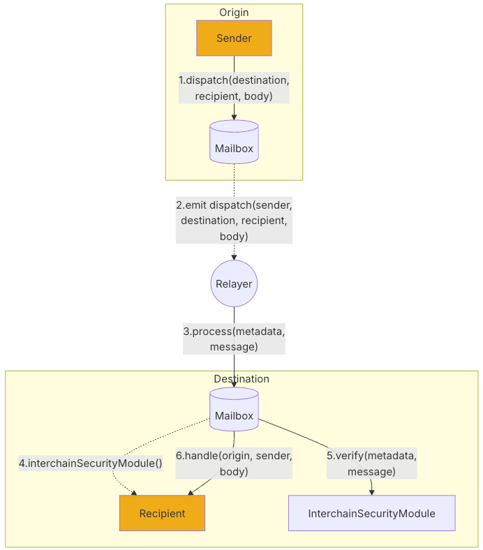

# Introduction of Hyperlane

Hyperlane is a permissionless interoperability protocol enabling cross-chain communication across different blockchain environments. It allows message passing and asset transfers between chains without centralized intermediaries.

In this tutorial, I break down the core mechanics of Hyperlane using a real cross-chain transaction from Milkyroad Chain to Binance Smart Chain (BSC). I walk through the underlying protocol flow, explain the key smart contract code involved, and analyze the events emitted throughout the process.

# Mechanism of Hyperlane

## Key Components



**Mailbox:** Smart contract deployed on every Hyperlane-supported chain. It provides the on-chain API for sending and receiving interchain messages.

**Relayer**:  Delivering messages from origin to destination chains.

**ISM**:  Smart contracts responsible for verifying that interchain messages delivered on the destination chain were actually sent on the origin chain.

---

## On The Source Chain Side

We will break down the process of cross-chain transactions using a real transaction I conducted myself, where I transferred 100 Milk tokens from MilkyWay to BSC. The transaction details on the MilkyWay chain can be viewed here:

[https://www.mintscan.io/milkyway/tx/7E7196522D945DA3F0CCD9EB48C47D22350CF860F8F9BF3537BFDDC456B2A968?height=6466778](https://www.mintscan.io/milkyway/tx/7E7196522D945DA3F0CCD9EB48C47D22350CF860F8F9BF3537BFDDC456B2A968?height=6466778)

On the sender’s side(milkeyroad chain), since it is a cosmos-based chain, it uses the Cosmos SDK module to perform operations:

[https://docs.hyperlane.xyz/docs/alt-vm-implementations/cosmos-sdk](https://docs.hyperlane.xyz/docs/alt-vm-implementations/cosmos-sdk)


### 1. Origin Chain Invocation (MilkyWay)

To initiate a cross-chain transfer, the sender on MilkyWay submits a `/hyperlane.warp.v1.MsgRemoteTransfer` message.

In this transaction, the following message was executed:

```json
{
  "@type": "/hyperlane.warp.v1.MsgRemoteTransfer",
  "sender": "milk1ufuzdvhuzg5jtn0jfeuwayqr7n8pjm856zg4dn",
  "token_id": "0x726f757465725f61707000000000000000000000000000010000000000000000",
  "destination_domain": 56,
  "recipient": "0x00000000000000000000000069534d8f4df8a07bf44ac59866d3787a375cc1be",
  "amount": "100000000",
  "custom_hook_id": null,
  "gas_limit": "64000",
  "max_fee": {
    "denom": "umilk",
    "amount": "4379232"
  },
  "custom_hook_metadata": ""
}

```

Where:

- `destination_domain`  is the chainId for the destination, 56 refers to BSC
- `recipient` is the destination EVM address
- `amount = 100000000` represents 100 MILK
- `max_fee` covers interchain gas payment for execution on the destination chain

Upon execution, the Warp router processes the transfer by burning (or in other token’s configuration locking) the MILK tokens on MilkyWay.

---

### 2. Hyperlane Message Construction

After the Warp module processes the transfer, Hyperlane constructs a canonical cross-chain message, emitted via:

`/hyperlane.core.v1.EventDispatch`

```json
{
  "destination": "56",
  "message": "0x03...",
  "origin_mailbox_id": "0x68797065726c616e65...",
  "recipient": "0x0000000000000000000000007b4bf9feccff207ef2cb7101ceb15b8516021acd",
  "sender": "0x726f757465725f617070...",
  "msg_index": "0"
}

```

This encoded payload serves as Hyperlane’s standardized message format across all supported chains.

---

### 3. Message Commitment to Merkle Tree

The dispatched message is then inserted into Hyperlane’s Merkle tree, as shown by:

`/hyperlane.core.post_dispatch.v1.EventInsertedIntoTree`

```json
{
  "index": "792",
  "merkle_tree_hook_id": "0x726f757465725f706f73745f6469737061746368...",
  "message_id": "0x7cf678c2a88eebda50fade6c7abdba5091777777d0d202ecdbe118d91125bef5",
  "msg_index": "0"
}

```

Each message becomes a leaf in the Merkle tree.

Periodically, `validators` sign the Merkle root, and the signed root is relayed to destination chains.

## Message Delivery on the Destination Chain


Once the Hyperlane message is committed on the origin chain and its Merkle root is signed by validators, a relayer submits the message to the destination chain (BSC) for execution.

This is performed by calling the Mailbox contract’s `process()` function:

```solidity
function process(
    bytes calldata metadata,
    bytes calldata message
) external payable;

```

Where:

- `message` is the canonical Hyperlane message constructed on MilkyWay
- `metadata` contains proof material required by the Interchain Security Module (ISM)

Note that you can find the relevant information of the transaction on BSC here:
[https://app.blocksec.com/phalcon/explorer/tx/bsc/0x8d90e8ef09a486a78a63815902df10f6c9c12032d1c34584762fdedd86a42e44](https://app.blocksec.com/phalcon/explorer/tx/bsc/0x8d90e8ef09a486a78a63815902df10f6c9c12032d1c34584762fdedd86a42e44)

---

### 1. Relayer invokes Mailbox via Transparent Proxy

On BSC, the Mailbox is deployed as a `TransparentUpgradeableProxy`.


The relayer calls:

```
TransparentUpgradeableProxy.process(...)
```

which is delegated to the Mailbox implementation contract.


---

### 2. Mailbox forwards verification to the ISM

Inside the Mailbox implementation:

- The `process()` function extracts the message fields
- It forwards both `message` and `metadata` to the recipient’s configured **Interchain Security Module (ISM)**


This occurs through:

```solidity
IInterchainSecurityModule.verify(metadata, message)
```

In our trace, verification was finalized by Multisig verification modules.


---

### 3. Successful verification authorizes message delivery


Once the ISM confirms validity, the message is considered authentic. At this point, the Mailbox proceeds with delivery by executes recipient contract.

The Mailbox calls:

```solidity
recipient.handle(origin, sender, message)

```

Where the recipient is the Milk token contract on BSC.

Inside, the message is decoded, the amount and recipient are extracted and the token minting logic is executed.

This results in 

```
Transfer:
from: 0x0000000000000000000000000000000000000000
to:   0x69534d8f4df8a07bf44ac59866d3787a375cc1be
value: 100,000,000

```

And the event:

```
ReceivedTransferRemote(origin, recipient, amount)

```

This confirms that:

100 MILK was successfully minted on BSC and was delivered to the intended EVM address

# Contract Auditing

## Mailbox

Contract:

[https://bscscan.com/address/0x2971b9aec44be4eb673df1b88cdb57b96eefe8a4](https://bscscan.com/address/0x2971b9aec44be4eb673df1b88cdb57b96eefe8a4)

---

### Replay Attacks (Message Uniqueness & Reuse Protection)

The Mailbox contract implements multiple safeguards to ensure that cross-chain messages are unique and cannot be replayed either within the same chain or across chains.

Message verification is performed in the `process` function via the Interchain Security Module (ISM). As part of this process, the contract validates that the message is explicitly intended for the current Mailbox instance:

```solidity
require(_message.version() == VERSION, "Mailbox: bad version");
require(
    _message.destination() == localDomain,
    "Mailbox: unexpected destination"
);

```

These checks bind the message to a specific protocol version and destination domain, preventing cross-domain replay.

Additionally, the contract enforces one-time execution of each message by tracking delivery status:

```solidity
// Check that the message hasn't already been delivered.
bytes32 _id = _message.id();
require(delivered(_id) == false, "Mailbox: already delivered");

```

Once a message ID is processed, it cannot be reused.

---

### Nonce-Based Global Uniqueness

Each dispatched message is assigned a monotonically increasing nonce, which is incorporated into the message ID. This guarantees global uniqueness across all dispatched messages.

Within the `dispatch` function:

```solidity
function dispatch(
    uint32 destinationDomain,
    bytes32 recipientAddress,
    bytes calldata messageBody,
    bytes calldata metadata,
    IPostDispatchHook hook
) public payable virtual returns (bytes32) {
    ...

    /// CHECKS ///

    // Format the message into packed bytes.
    bytes memory message = _buildMessage(
        destinationDomain,
        recipientAddress,
        messageBody
    );
    bytes32 id = message.id();

    /// EFFECTS ///

    latestDispatchedId = id;
    nonce += 1;

    ...

    return id;
}

```

The nonce is incremented after each dispatch and embedded into the message payload via `_buildMessage`:

```solidity
function _buildMessage(
    uint32 destinationDomain,
    bytes32 recipientAddress,
    bytes calldata messageBody
) internal view returns (bytes memory) {
    return Message.formatMessage(
        VERSION,
        nonce,
        localDomain,
        msg.sender.addressToBytes32(),
        destinationDomain,
        recipientAddress,
        messageBody
    );
}

```

### Owner Privileges (Administrative Control)

The Mailbox contract inherits OpenZeppelin’s `OwnableUpgradeable`, establishing a privileged owner role that is initialized during contract setup and remains transferable.

Ownership is assigned in the `initialize` function:

```solidity
function initialize(
    address _owner,
    address _defaultIsm,
    address _defaultHook,
    address _requiredHook
) external initializer {
    __Ownable_init();
    setDefaultIsm(_defaultIsm);
    setDefaultHook(_defaultHook);
    setRequiredHook(_requiredHook);
    transferOwnership(_owner);
}

```

---

The owner holds exclusive authority to modify core Mailbox components that directly impact message verification and post-dispatch behavior:

- `setDefaultIsm` — updates the default Interchain Security Module (ISM) responsible for message validation
- `setDefaultHook` — sets the default post-dispatch hook executed after message dispatch
- `setRequiredHook` — sets a mandatory post-dispatch hook that must be executed

```solidity
/**
 * @notice Sets the default ISM for the Mailbox.
 * @param _module The new default ISM. Must be a contract.
 */
function setDefaultIsm(address _module) public onlyOwner {
    require(
        Address.isContract(_module),
        "Mailbox: default ISM not contract"
    );
    defaultIsm = IInterchainSecurityModule(_module);
    emit DefaultIsmSet(_module);
}

/**
 * @notice Sets the default post dispatch hook for the Mailbox.
 * @param _hook The new default post dispatch hook. Must be a contract.
 */
function setDefaultHook(address _hook) public onlyOwner {
    require(
        Address.isContract(_hook),
        "Mailbox: default hook not contract"
    );
    defaultHook = IPostDispatchHook(_hook);
    emit DefaultHookSet(_hook);
}

/**
 * @notice Sets the required post dispatch hook for the Mailbox.
 * @param _hook The new required post dispatch hook. Must be a contract.
 */
function setRequiredHook(address _hook) public onlyOwner {
    require(
        Address.isContract(_hook),
        "Mailbox: required hook not contract"
    );
    requiredHook = IPostDispatchHook(_hook);
    emit RequiredHookSet(_hook);
}

```

### Owner Contract of Mailbox

[https://bscscan.com/address/0x7379D7bB2ccA68982E467632B6554fD4e72e9431#readProxyContract](https://bscscan.com/address/0x7379D7bB2ccA68982E467632B6554fD4e72e9431#readProxyContract)

The Mailbox contract is controlled by an owner role implemented as a Safe multisignature wallet. In this deployment, the Safe is configured with a 6-out-of-10 signature threshold.

The Safe is responsible for transferring ownership of the Mailbox contract when governance changes are required. To assign a new owner, at least 6 signer confirmations have to be received.

### Message Verification via Interchain Security Module (ISM)

Within the Mailbox contract, message authenticity is enforced through an ISM. The specific ISM used for verification is dynamically resolved based on the message recipient.

The contract retrieves the ISM as follows:

```solidity
IInterchainSecurityModule ism = recipientIsm(recipient);
```

The `recipientIsm` function allows each recipient contract to optionally define its own verification logic by implementing `interchainSecurityModule()`. If the recipient does not specify a valid ISM, the Mailbox falls back to the globally configured default ISM.

```solidity
function recipientIsm(
    address _recipient
) public view returns (IInterchainSecurityModule) {
    // Use low-level staticcall to safely query recipient ISM
    (bool success, bytes memory returnData) = _recipient.staticcall(
        abi.encodeCall(
            ISpecifiesInterchainSecurityModule.interchainSecurityModule,
            ()
        )
    );

    // If a valid response is returned, decode and use it
    if (success && returnData.length != 0) {
        address ism = abi.decode(returnData, (address));
        if (ism != address(0)) {
            return IInterchainSecurityModule(ism);
        }
    }

    // Fallback to the default ISM if none is specified
    return defaultIsm;
}

```

Once the appropriate ISM is resolved, the `process` function relies entirely on it to authenticate the cross-chain message:

```solidity
require(
    ism.verify(_metadata, _message),
    "Mailbox: ISM verification failed"
);

```

Only messages that successfully pass the ISM’s verification logic are executed.

## StaticAggregationIsm

[https://bscscan.com/address/0x0dad192103c9b4ada870f3d97c8168297a8554d1](https://bscscan.com/address/0x0dad192103c9b4ada870f3d97c8168297a8554d1)

The `StaticAggregationIsm` contract implements a threshold-based (m-of-n) message verification model by aggregating the results of multiple Interchain Security Modules (ISMs). Rather than relying on a single verifier, the system requires a predefined number of independent ISMs to successfully validate a message before it is accepted.

Note that the threshold and the adopted ISMs are hardcoded into the contract.

### Aggregated Verification Logic

The `verify` function retrieves a fixed set of ISM modules and a required verification threshold associated with the message:

```solidity
/**
 * @notice Requires that m-of-n ISMs verify the provided interchain message.
 * @param _metadata ABI encoded module metadata (see AggregationIsmMetadata.sol)
 * @param _message Formatted Hyperlane message (see Message.sol).
 */
function verify(
    bytes calldata _metadata,
    bytes calldata _message
) public returns (bool) {
    (address[] memory _isms, uint8 _threshold) = modulesAndThreshold(_message);
    uint256 _count = _isms.length;

    for (uint8 i = 0; i < _count; i++) {
        if (!AggregationIsmMetadata.hasMetadata(_metadata, i)) continue;

        IInterchainSecurityModule _ism = IInterchainSecurityModule(_isms[i]);
        require(
            _ism.verify(
                AggregationIsmMetadata.metadataAt(_metadata, i),
                _message
            ),
            "!verify"
        );

        _threshold -= 1;
    }

    require(_threshold == 0, "!threshold");
    return true;
}

```

---

### Configuration in This Deployment

In the audited deployment, the threshold is configured as:

> threshold = 1
> 


## StaticMessageIdMultisigIsm

[https://bscscan.com/address/0x7408f224a4dbab5facba548a9fbb9801656cd0dc](https://bscscan.com/address/0x7408f224a4dbab5facba548a9fbb9801656cd0dc)

The `StaticMessageIdMultisigIsm` contract implements a multisignature-based verification model in which a fixed set of validators must collectively approve each cross-chain message. Verification requires a predefined threshold of validator signatures over a deterministic message digest.

---

### Validator Set and Threshold Configuration

The validator addresses and signature threshold are returned by:

```solidity
function validatorsAndThreshold(
    bytes calldata
) public pure override returns (address[] memory, uint8) {
    return abi.decode(MetaProxy.metadata(), (address[], uint8));
}

```

Notably, the validator set is **static** and not derived from message content or dynamic state. Instead, it is retrieved from metadata embedded directly into the contract bytecode at deployment time.

This metadata is extracted using low-level calldata operations:

```solidity
function metadata() internal pure returns (bytes memory) {
    bytes memory data;
    assembly {
        let posOfMetadataSize := sub(calldatasize(), 32)
        let size := calldataload(posOfMetadataSize)
        let dataPtr := sub(posOfMetadataSize, size)
        data := mload(64)
        // Increment free memory pointer by metadata size + length slot
        mstore(64, add(data, add(size, 32)))
        mstore(data, size)
        let memPtr := add(data, 32)
        calldatacopy(memPtr, dataPtr, size)
    }
    return data;
}

```

As a result, validator membership is fixed at deployment.

---

### Message Digest Construction

To bind signatures to a specific cross-chain message and prevent replay, the contract constructs a unique digest:

```solidity
function digest(
    bytes calldata _metadata,
    bytes calldata _message
) internal pure override returns (bytes32) {
    return CheckpointLib.digest(
        _message.origin(),
        _metadata.originMerkleTreeHook(),
        _metadata.root(),
        _metadata.index(),
        _message.id()
    );
}

```

The digest incorporates:

- The source chain (origin domain)
- Merkle root and proof index
- The unique message ID

This ensures signatures are tightly bound to:

- A specific message
- A specific origin chain
- A specific Merkle inclusion proof

effectively preventing replay across chains or across different messages.

---

### Multisignature Verification Process

The `verify` function enforces threshold-based signature validation:

```solidity
function verify(
    bytes calldata _metadata,
    bytes calldata _message
) public view returns (bool) {
    bytes32 _digest = digest(_metadata, _message);
    (
        address[] memory _validators,
        uint8 _threshold
    ) = validatorsAndThreshold(_message);
    require(_threshold > 0, "No MultisigISM threshold present for message");

    uint256 _validatorCount = _validators.length;
    uint256 _validatorIndex = 0;

    // Assumes signatures are ordered by validator address
    for (uint256 i = 0; i < _threshold; ++i) {
        address _signer = ECDSA.recover(_digest, signatureAt(_metadata, i));

        // Search for signer in validator set
        while (
            _validatorIndex < _validatorCount &&
            _signer != _validators[_validatorIndex]
        ) {
            ++_validatorIndex;
        }

        // Fail if signer is not an approved validator
        require(_validatorIndex < _validatorCount, "!threshold");
        ++_validatorIndex;
    }
    return true;
}

```

Key properties:

- Requires `m` valid signatures out of `n` validators
- Only addresses in the embedded validator set are accepted
- Signatures must be ordered to prevent duplicates and bypass attempts

The implementation uses OpenZeppelin’s `ECDSA` library, which provides:

- Protection against signature malleability
- Safe recovery of signer addresses

---

## Milk Token on BSC

[https://bscscan.com/address/0x7b4bf9feccff207ef2cb7101ceb15b8516021acd](https://bscscan.com/address/0x7b4bf9feccff207ef2cb7101ceb15b8516021acd)

### Ownership and Governance

The Milk token contract on BSC is controlled by a Safe multisignature wallet rather than a single externally owned account. In this deployment, the Safe is configured with a **3-of-4 signature threshold**, requiring approval from three signers to execute privileged administrative actions.

---

### Owner Privileges

The owner holds authority over key cross-chain and routing parameters, including:

- `setDestinationGas` — configures gas limits for cross-chain message execution
- `enrollRemoteRouter` — registers trusted remote routers for cross-chain communication
- `unenrollRemoteRouter` — removes previously registered remote routers
- `setHook` — sets a post-dispatch hook contract (if any)
- `setInterchainSecurityModule` — updates the ISM used for message verification

---

### Current Configuration State

At the time of review, the contract parameters are set as follows:

**Post-dispatch hook:**

```solidity
hook(0x7f5a7c7b):
0x0000000000000000000000000000000000000000
```

No hook contract is currently configured.

---

**Interchain Security Module (ISM):**

```solidity
interchainSecurityModule (0xde523cf3):
0xCCB6C70c6993F06a9B6134bdD8686d69727c4314
```

This corresponds to the multisignature-based ISM discussed previously.

---

**Registered remote domain:**

```solidity
domains (0x440df4f4):
1835625579
```

This domain identifier represents the Milk chain.

---

**Destination gas configuration:**

```solidity
destinationGas(1835625579) → 44000
```

## Other Security Considerations

### Validator Liveness and Censorship Risk

The protocol does not enforce any time-bound requirement for validators to sign cross-chain messages. There are no on-chain deadlines or alternative execution paths if validators fail to act.

In the current configuration, the effective validator set consists of **a single validator**. As a result:

- Message execution is entirely dependent on one signer
- A valid message can be indefinitely delayed or censored

---

### Fixed Interchain Gas Configuration

Cross-chain message execution uses a fixed gas allocation that is independent of the transferred token amount:

```solidity
destinationGas(1835625579) → 44000
```

While this simplifies fee estimation, it may:

- Fail if execution costs increase due to opcode changes or additional logic
- Lead to stuck messages if gas becomes insufficient
- Require frequent administrative intervention to remain functional

---

### Mint-Based Asset Bridging (No Slippage Exposure)

Token bridging on the destination chain is implemented via direct ERC20 minting:

```solidity
function _transferTo(
    address _recipient,
    uint256 _amount,
    bytes calldata
) internal virtual override {
    _mint(_recipient, _amount);
}
```

Because assets are minted rather than swapped through liquidity pools:

- No price slippage is introduced
- No AMM manipulation risk is present
- Supply inflation is entirely controlled by cross-chain message validation